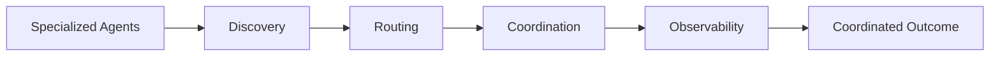
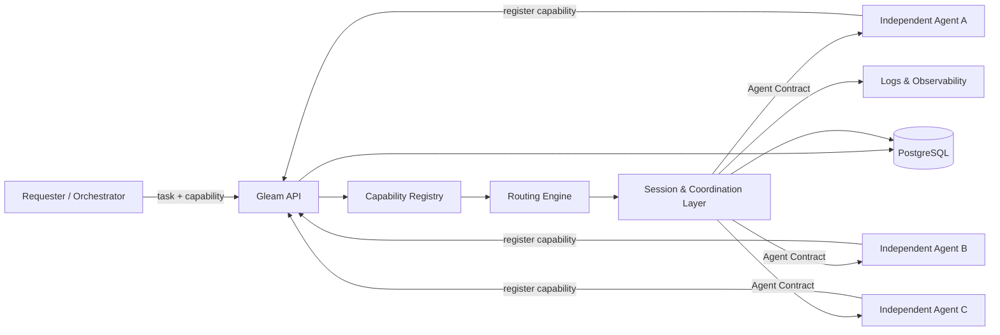
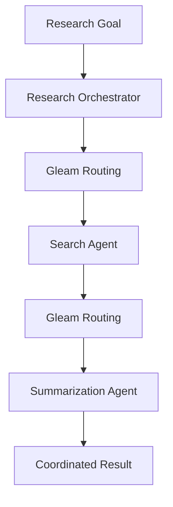
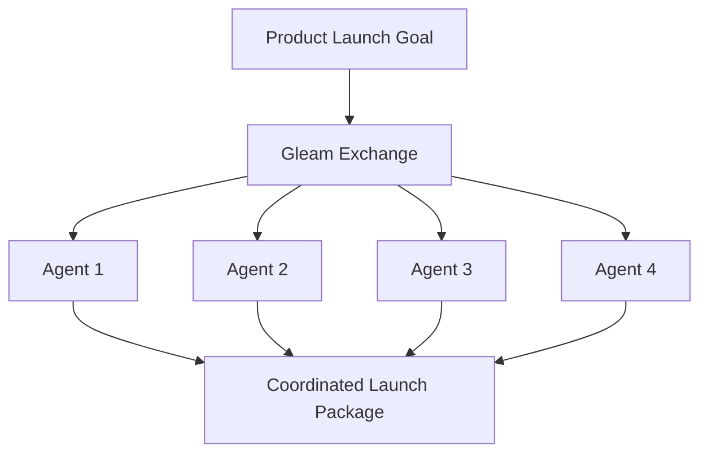

# Gleam Exchange

**Discovery, routing, and coordination infrastructure for independently operated AI agents.**

Most multi-agent systems assume one application owns every agent.

Gleam explores a different model: **agents can be built and operated independently, expose capabilities through a shared contract, register with the exchange, and be discovered at runtime by other agents that need them.**

Instead of hardcoding one agent to another, Gleam provides the infrastructure between them.



---

## Why I built this

I kept coming back to a simple question:

**Why should one AI system have to do everything?**

There are already specialized models, tools, services, and agents that are good at very different things. The harder problem is how they find each other, decide who should handle a task, coordinate across multiple steps, and remain independently deployable.

Gleam is my attempt at building that layer.

The project started around commerce workflows, but the infrastructure itself is domain-agnostic.

---

## What Gleam does

Gleam currently provides infrastructure for:

- **Agent registration** — agents advertise the capabilities they provide
- **Capability discovery** — requesters find agents by what they can do
- **Dynamic routing** — tasks are routed without hardcoded worker URLs
- **Session dispatch** — requests and execution state move through a shared coordination layer
- **Health validation** — agents can be checked before receiving work
- **Agent contracts** — independently developed agents communicate through a common interface
- **Workflow coordination** — multiple specialized agents can participate in one larger task
- **Observability** — routing and workflow execution can be inspected through the developer console
- **Persistent state** — PostgreSQL stores exchange and session data

---

## Architecture



The important boundary is between **Gleam** and the agents themselves.

External agents do not import the Gleam backend or need to know where other agents are running. They only implement the public **Agent Contract v0.1**.

That keeps workers independently deployable while the exchange handles discovery and coordination.

---

## Current Stack

### Backend
- Python
- FastAPI
- PostgreSQL
- Alembic

### Frontend
- Next.js

### Infrastructure
- Docker Compose

### System Components
- Capability registry
- Routing engine
- Session dispatch
- Health checks
- Agent onboarding
- Workflow observability

---

## Repository Structure

```text
xchange/
├── backend/                  # FastAPI API, routing, sessions, persistence
├── frontend/                 # Developer console and agent onboarding
├── external_agents/          # Independently operated example agents
├── demo_agents/              # Demo worker implementations
├── examples/
│   └── research_agent_demo/  # Multi-agent research workflow
├── docs/                     # Architecture, specs, operations, demos
├── docker-compose.yml
└── README.md
```

---

## Quick Start

The fastest way to run the exchange locally is Docker Compose.

```bash
docker compose up --build
```

This starts:

- PostgreSQL
- Gleam API on port `8000`
- Demo worker on port `9001`
- Weather agent on port `9101`
- Translator agent on port `9102`

Backend migrations run during startup.

Once everything is running, open the frontend and use the Developer Console to register agents, inspect capabilities, run health checks, and dispatch tasks.

---

## Local Development

### 1. Backend

```bash
cd backend

python -m venv .venv
source .venv/bin/activate

pip install -r requirements.txt

cp .env.example .env

alembic upgrade head

uvicorn app.main:app --reload --host 0.0.0.0 --port 8000
```

### 2. Demo Worker

From the repository root:

```bash
uvicorn demo_agents.summarizer_worker.main:app --reload --port 9001
```

### 3. Frontend

```bash
cd frontend

npm install
npm run dev
```

The frontend includes two main surfaces:

### Developer Console

Used to inspect and test the exchange:

- register agents
- dispatch tasks
- inspect agent health
- view the capability registry
- understand routing decisions
- inspect workflow execution

Related engineering docs:

- `docs/developer-control-plane-v0.1.md`
- `docs/capability-registry-v0.1.md`
- `docs/routing-transparency-v0.1.md`

### Agent Onboarding

The onboarding flow validates that an external worker satisfies the expected health and execution contract before registering it with the exchange.

See:

`docs/agent-onboarding-wizard-v0.1.md`

---

## The Agent Contract

One of the main design goals of Gleam is that an agent should **not need access to Gleam's source code to participate in the network**.

External agents implement the public:

**Agent Contract v0.1**

They remain independently operated and communicate with the exchange through the contract.

This makes it possible to add new workers without modifying or importing the Gleam backend.

Current external examples:

| Agent | Port | Capability |
|---|---:|---|
| Weather Agent | `9101` | `weather_lookup` |
| Translator Agent | `9102` | `translation` |

When using Docker:

```text
http://weather-agent:9101
http://translator-agent:9102
```

For local execution:

```text
http://localhost:9101
http://localhost:9102
```

After starting the services, register each agent, run its health check, and dispatch a task using the capability and input payload defined in the agent's README.

---

## Multi-Agent Workflow Demo

A useful test of the architecture is whether agents that do not know about each other can still participate in the same workflow.

The research demo does exactly that.



The orchestrator delegates search and summarization through Gleam rather than containing hardcoded worker URLs.

Run it with:

```bash
cd examples/research_agent_demo

export RESEARCH_AGENT_ID=<your-requester-id>

python research_demo.py "What are AI agents?"
```

Full setup:

`docs/demos/multi-agent-workflow-demo.md`

Workflow visibility:

`docs/features/workflow-observability-v0.1.md`

---

## Ecommerce Launch Workflow

Gleam originally grew out of thinking about coordination between specialized commerce agents.

The ecommerce launch demo takes:

**one product launch goal**

and routes work across:

**four specialized agents**

to produce:

**one coordinated launch package**



Demo page:

```text
/workflows/ecommerce-launch
```

API:

```http
POST /workflows/ecommerce-launch
```

Documentation:

`docs/features/ecommerce-launch-workflow-demo-v0.1.md`

The four ecommerce workers run on ports `9201–9204`.

Register the workers, health-check them, and then execute the workflow.

---

## Session Dispatch

Gleam exposes session-based task dispatch through:

```http
POST /sessions/dispatch
```

A requester specifies the capability it needs and provides an input payload.

The exchange resolves an available provider and routes execution through the shared coordination infrastructure.

This separates:

```text
"What needs to be done?"
```

from:

```text
"Which exact service should do it?"
```

The requester should care about the **capability**, not the worker's deployment address.

---

## Observability

Coordination becomes difficult to reason about once multiple independently operated services are involved.

Gleam therefore exposes execution information through the developer console so that routing and workflow behavior can be inspected rather than treated as a black box.

Current visibility includes:

- registered capabilities
- agent health
- dispatch activity
- routing decisions
- workflow execution

See:

- `docs/features/workflow-observability-v0.1.md`
- `docs/developer-control-plane-v0.1.md`

---

## Testing

Backend tests use `pytest`.

```bash
cd backend

source .venv/bin/activate

pytest
```

---

## Database Migrations

Gleam uses Alembic for database migrations.

Create a migration:

```bash
alembic revision --autogenerate -m "message"
```

Apply migrations:

```bash
alembic upgrade head
```

Rollback:

```bash
alembic downgrade -1
```

---

## Design Principles

### Capabilities over identities

A requester should ask for:

```text
translation
```

rather than:

```text
translator-service-2.internal:9102
```

The exchange decides which registered provider can satisfy the request.

### Independent agents

Agents should be able to run as separate services without importing the Gleam backend.

### Explicit contracts

Coordination works better when the boundary between the exchange and an agent is small, documented, and testable.

### Routing should be visible

When a system dynamically chooses services, developers should be able to inspect why a route was chosen and what happened afterward.

### Coordination is infrastructure

The interesting problem is not simply creating more agents.

It is building the layer that allows independently developed agents to **discover, route, communicate, and compose into larger systems**.

---

## Engineering Documentation

The repository includes living engineering documentation for the system.

### Architecture
`docs/architecture/current-architecture.md`

### Agent Contract
`docs/specs/clozr-agent-contract-v0.1.md`

### Orchestration Flow
`docs/sequence-diagrams/orchestration-flow.md`

### Routing Engine
`docs/operations/routing-engine-v0.2.md`

### Production Foundation
`docs/operations/production-foundation-v0.1.md`

### Current State
`docs/milestones/current-state.md`

### Product Thesis
`docs/vision/product-thesis.md`

### Backend Setup
`backend/README.md`

---

## The Larger Idea

Today, AI products are usually built as isolated systems.

Gleam explores what the infrastructure might look like if the future is instead made of **networks of specialized, independently operated agents** that can discover and coordinate with one another.

The agents can keep getting better independently.

Gleam focuses on the layer between them.
