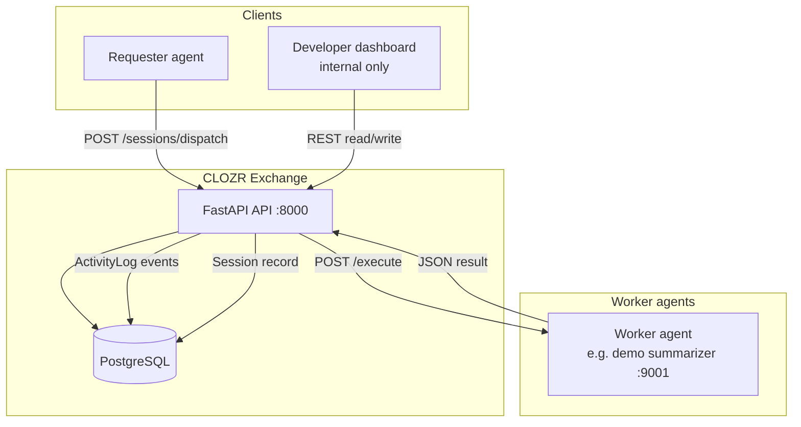
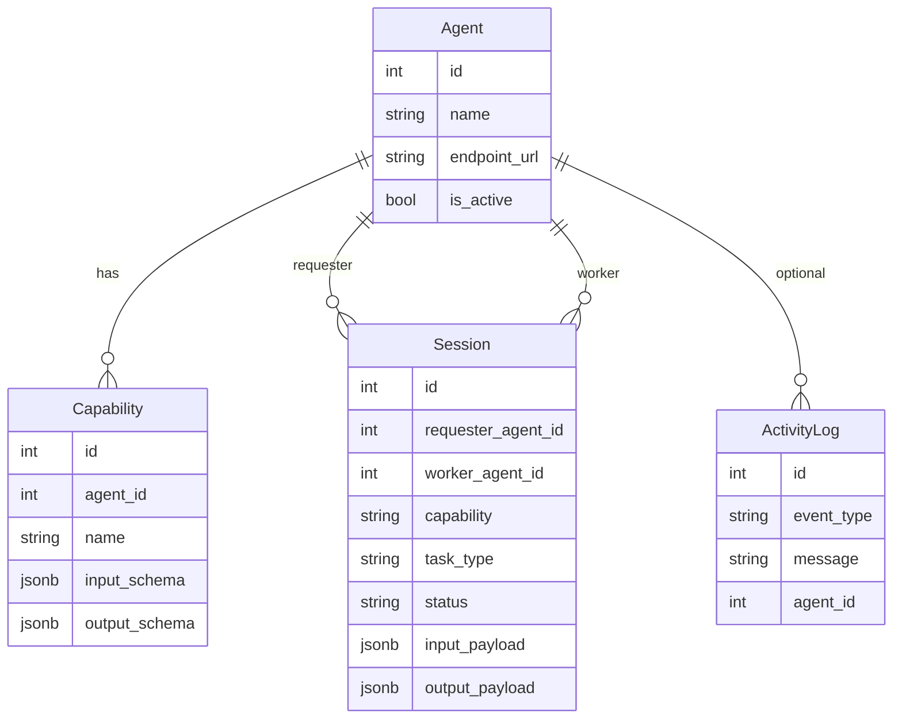

# Current Architecture

CLOZR Exchange is **domain-agnostic AI agent coordination infrastructure**. The exchange core handles registration, discovery, routing, sessions, orchestration, and logs. It does not contain vertical or domain-specific business logic—that lives in independently operated worker agents.

## System components (today)

| Component | Role | Technology |
|-----------|------|------------|
| **Exchange API** | Registry, routing, session lifecycle, activity logs | Python, FastAPI, SQLAlchemy, PostgreSQL |
| **Worker agents** | Execute tasks at their own HTTP endpoints | Any stack; demo uses FastAPI |
| **Developer dashboard** | Internal observability and manual dispatch testing | Next.js, TypeScript, Axios |
| **PostgreSQL** | Persistent storage for agents, capabilities, sessions, logs | Local / Homebrew / Docker |

## Exchange core concepts

The exchange layer currently understands:

- **Agents** — registered participants with name, endpoint URL, version, and metadata
- **Capabilities** — named skills an agent advertises (with optional JSON schemas)
- **Sessions** — a single orchestration run from dispatch through worker response
- **Routing** — select an active worker that offers the requested capability
- **Orchestration** — synchronous dispatch: create session → call worker → store result
- **Activity logs** — append-only events for registration and session lifecycle

Commerce, billing, auth, queues, and reputation are **not** in the exchange core today.

## Architecture diagram



## Data model (current)



## API surface (implemented)

| Method | Path | Purpose |
|--------|------|---------|
| GET | `/health` | API health check |
| POST | `/agents/register` | Register agent + capabilities |
| GET | `/agents/search?capability=` | Find active agents by capability name |
| GET | `/activity` | Recent activity log entries |
| POST | `/sessions/dispatch` | Route task to worker, execute, store session |
| GET | `/sessions` | List sessions (optional filters) |
| GET | `/sessions/{id}` | Single session detail |

There is no `GET /agents` list endpoint yet.

## Worker contract (current)

Workers are reached at:

`POST {agent.endpoint_url}/execute`

Request body:

```json
{
  "session_id": 1,
  "task_type": "summarize_text",
  "capability": "summarization",
  "input_payload": {}
}
```

Response: JSON object stored as `output_payload` on success.

## Repository layout

```
backend/           Exchange API
frontend/          Developer dashboard (not the product)
demo_agents/       Local demo worker (summarizer)
docs/              Living engineering documentation
```

## Operational notes

- Dispatch is **synchronous** in the API request (no job queue).
- Tables are created on API startup via SQLAlchemy `create_all`.
- CORS allows the dashboard origin (`localhost:3000`) only.
