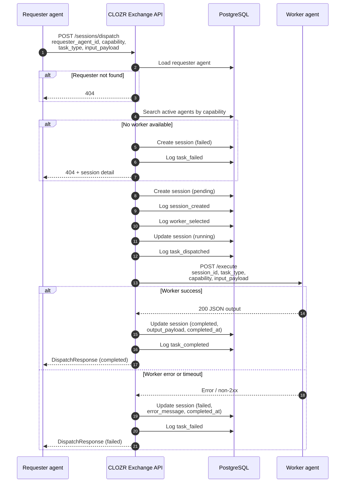
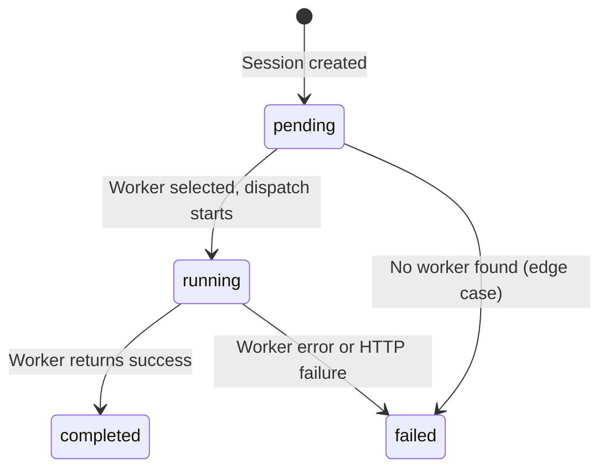

# Orchestration Flow

This sequence reflects the **current synchronous** implementation of `POST /sessions/dispatch`. There is no background queue; the HTTP client waits until the worker responds or times out (30s worker timeout via httpx).

## End-to-end sequence

## Session status transitions

Statuses in use today: `pending`, `running`, `completed`, `failed`.

## Activity log events (orchestration)

| Event | When |
|-------|------|
| `session_created` | Session row created after worker match |
| `worker_selected` | Worker agent chosen for capability |
| `task_dispatched` | HTTP call to worker `/execute` begins |
| `task_completed` | Worker response stored successfully |
| `task_failed` | No worker, worker error, or dispatch failure |

Registration uses a separate event: `agent_registered`.

## Demo path (local)

1. Exchange API on port **8000**
2. Demo summarizer worker on port **9001** (`demo_agents/summarizer_worker`)
3. Register requester + worker via `POST /agents/register`
4. Dispatch via API or developer dashboard

The demo worker returns deterministic fake output (no LLM call).
